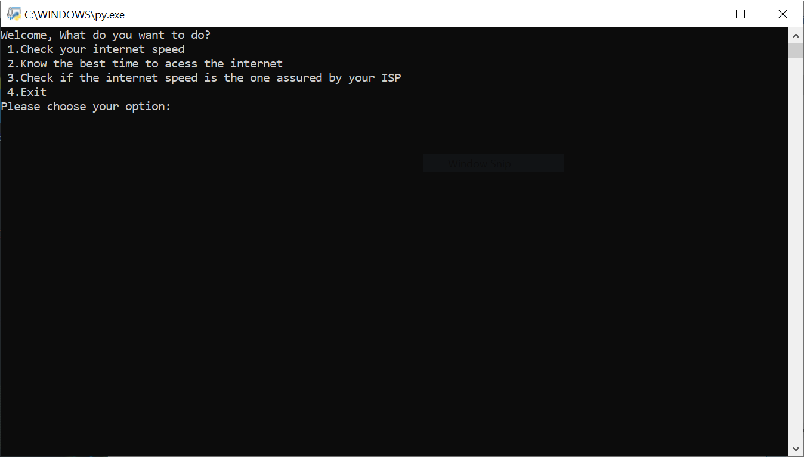

# Internet_SpeedTest

This program aims to measure the internet speed of the user.

# Requirements
- pandas
- matplotlib
- Datetime
- Speedtest-cli

The above libraries are to be installed using
`pip install library_name`

# Usage

## Measures the user's upload and download speed
The Download and Upload speed of the users are determined using the Speedtest()

## Suggests the best possible time for using internet
The user is provided with the best possible time for using the internet based on the information available in the **Speedx24hr.csv**
It also provides a bar chart to represent the variation of the internet speed over 24 hours

## Determines if the average speed
The average internet speed is determined to see if the speed is same as the one that is one provided by the ISP based on the dataset **isp.csv**

